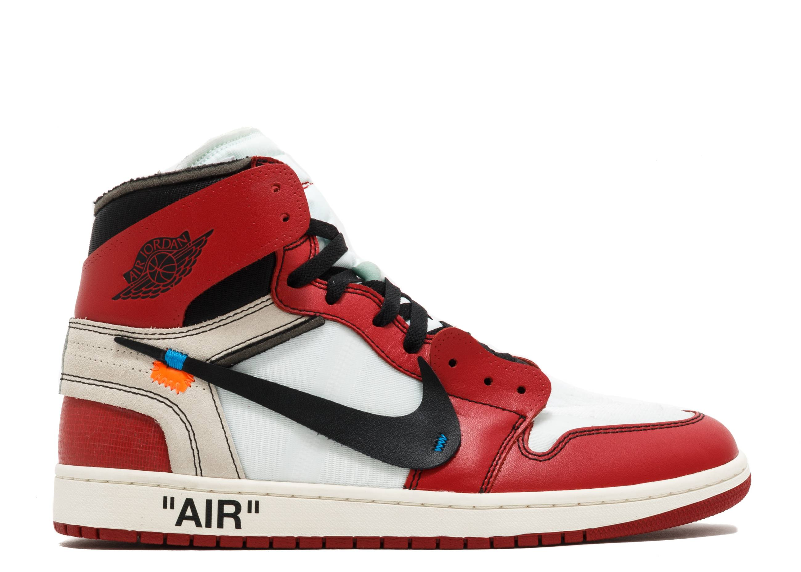
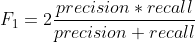
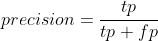
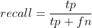

# Proposal
***Andrew Zhao***

#### Domain Background

This project is aimed to discover the differences in hyped sneakers and regular shoes as well as explore differences _hyped_ sneaker designs. _Hyped_ sneakers are defined as sneakers that are listed on popular resale sites such as **Goat**, **Flight Club** and **StockX**. The resale market of these coveted sneakers has flourished in the last couple of years. While some people still view _hyped_ sneakers has a past time hobby, others actually became professional resellers. Additionally, sneaker companies also interested to find out what “works” and what are some design practices that can make their products excel in resell markets.

Since _hyped_ sneakers have great business value for sneaker resellers and shoe brands alike, it is then appropriate to try to identify design characteristics in these _hyped_ sneakers that set them apart. The purpose of the project is to explore _hyped_ sneaker designs, what differs them from “everyday” shoes, as well as what are some character defining designs that different brands are doing to distinguish from their counter parts. 

#### Problem Statement

The most direct way to compare sneakers is to examine their design. It is therefore logical to examine shoe designs with their images. It is important to note that this view is going to ignore the background story of a shoe (eg. whether they are backed by popular celebrity). This project is going to scrutinize the images of shoes that are categorized as both _hyped_ and _non-hyped_. Some approaches will involve clustering[1], classification as well as image generation[2]. Clustering will attempt to find natural groupings in input data and make sure the dataset is explored thoroughly. For classification, two different tasks will be performed:

1. Binary classification to distinguish _hyped_ and _non-hyped_ shoes.
2. Multiclass classification to see how well machine learning algorithms can identify design differences in brands.

For both of these tasks, a common evaluation metric F1 score can be used to ensure validity of results if there exists class imbalance issues. Finally, GANs will be used to "generate" novel _hyped_ sneaker designs to find some more additional characteristics of _hyped_ sneakers.

#### Datasets and Inputs

The dataset will consist of two major parts: _hyped_ sneakers and _non-hyped_ shoes. For hyped shoes, all images will be obtained from **Goat**, **Flight Club** and **StockX**. Additionally, the shoe’s brand and names are included as file names to better find trends and identify them. For the _non-hyped_ shoes, search queries for men’s shoes on **Amazon** were used and the images were obtained from these queries. The brand and name of the **Amazon** product is excluded during the scraping phase because this project does not need this additional information. It is important to mention that there are two main assumptions in obtaining and subsequently use of this data:

1. Sites like **Amazon** do not carry _hyped_ shoes.
2. The orientation of the shoes and how the image is taken does not tremendously affect learning algorithms.

The data collected will also go through a manual selection process (get rid of images that do not conform to the dataset shoes orientations at all or products that were not shoes).

#### Solution Statement

In order to help resellers and brands to identify what makes a shoe excel in the resell market, there are several solutions that will be employed in this project. First, using clustering can find natural groupings of shoes that are already considered hyped. From there, we can see what shoes make up these groups and identify possible key characteristics from each group. Additionally, by generating _eigenimages_[3] can give us a rough idea of a certain group’s overarching characteristics. Next, we can use image classification to both distinguish a _hyped_ shoe from a _non-hyped_ one. This classification model can be extremely helpful for speculators when considering whether to stock up on a particular shoe model or not. Furthermore, the model can also help shoe companies to test out their new design and give a “hyped” score for their new shoe models. On the other hand, we can also perform brand classification and employ _explainable AI techniques_[4] to find key differences on what machine learning algorithms are looking for when identifying brands. This approach will possibly help brands further solidify their good design tendencies. Last but not least, generative adversarial networks can be used to generate new _hyped_ shoe designs to give inspiration to shoe companies.

#### Evaluation Metrics

The main evaluation metric for clustering will be measures of separation in groups and between groups. The measure of within and between group variance of the images are some common ways to achieve this. For classification tasks, it is important to be robust against unbalanced groups, which the problem existent in our dataset when classifying brands. Therefore, we will employ an evaluation metric that robust against imbalanced classes. The F1 score is defined as the harmonic mean of precision and recall:

Where _precision_ and _recall_ is defined as:

#### Project Design

1. Gather shoe images from **Goat**, **Flight Club**, **StockX** and **Amazon**.
2. Preprocess image data by first manually removing images that do not belong to the dataset at all (not shoes) or shoes that are oriented very differently from the rest (shoes pointing upwards or images showing a pair of shoes instead of a single shoe). Next, we can pad all the images that are not of the same size to the same size to make the subsequent training jobs easier.
3. Perform exploratory data analysis on the dataset.
4. Perform clustering and make eigen images of the clusters to identify key cluster defining factors.
5. Binary and multiclass classification and use of Grad-CAM[4] to explore learning algorithm's decisions.
6. GANs image generation.

---
[1]: Chang, Jianlong & Wang, Lingfeng & Meng, Gaofeng & Xiang, Shiming & Pan, Chunhong. (2017). Deep Adaptive Image Clustering. 5880-5888. 10.1109/ICCV.2017.626. 

[2]: Goodfellow, Ian & Pouget-Abadie, Jean & Mirza, Mehdi & Xu, Bing & Warde-Farley, David & Ozair, Sherjil & Courville, Aaron & Bengio, Y.. (2014). Generative Adversarial Nets. ArXiv. 

[3]: Zhang, Daoqiang & Chen, Songcan & Liu, Jun. (2005). Representing Image Matrices: Eigenimages Versus Eigenvectors. 3497. 659-664. 10.1007/11427445_107. 

[4]: Rs, Ramprasaath & Cogswell, Michael & Das, Abhishek & Vedantam, Ramakrishna & Parikh, Devi & Batra, Dhruv. (2019). Grad-CAM: Visual Explanations from Deep Networks via Gradient-Based Localization. International Journal of Computer Vision. 128. 10.1007/s11263-019-01228-7. 